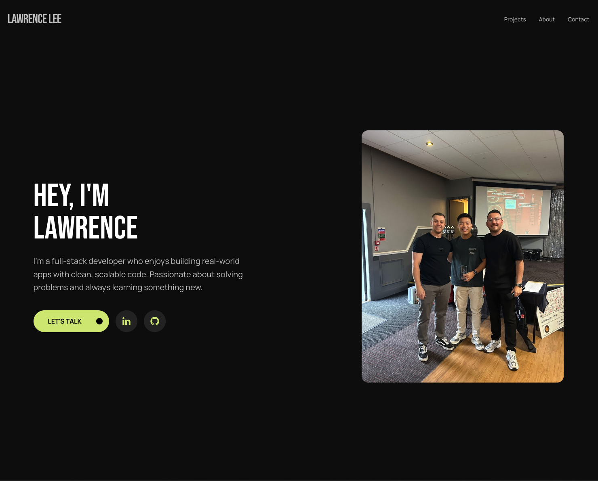

# Lawrence Lee - Portfolio Website

This is my personal portfolio site built with Next.js. It showcases my selected projects, technical skills, and experience as a full-stack developer. Designed to be clean, fast, and responsive.



👉 [Live Demo](https://lawrencelee.dev)

## Features

1. Clean, responsive design
2. Smooth scroll and modern UI
3. Highlights real projects with live demos
4. Deployed on Vercel with GitHub integration

## Tech Stack

- **Framework:** Next.js 14 (App Router)
- **Styling:** Tailwind CSS
- **Deployment:** Vercel

## Getting Started

To run the project locally:

```bash
npm install
npm run dev
```

Then visit [http://localhost:3000](http://localhost:3000) in your browser.

## Folder Structure

```txt
/app – Main pages and routing (App Router)
/components – Reusable UI components
/public – Static assets
```
